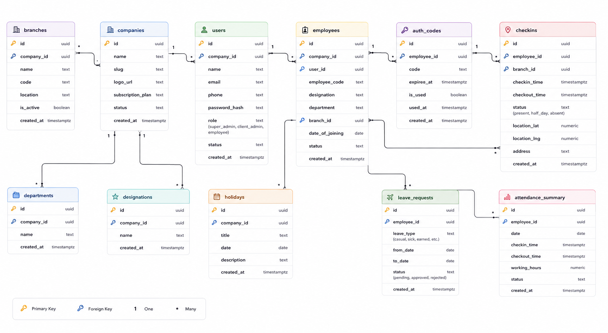
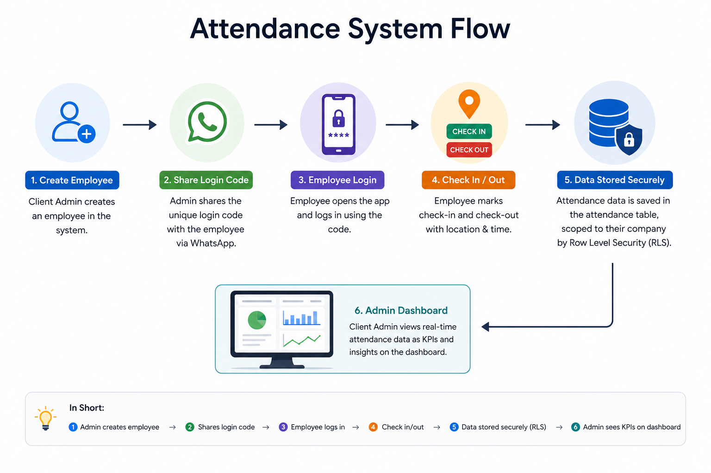
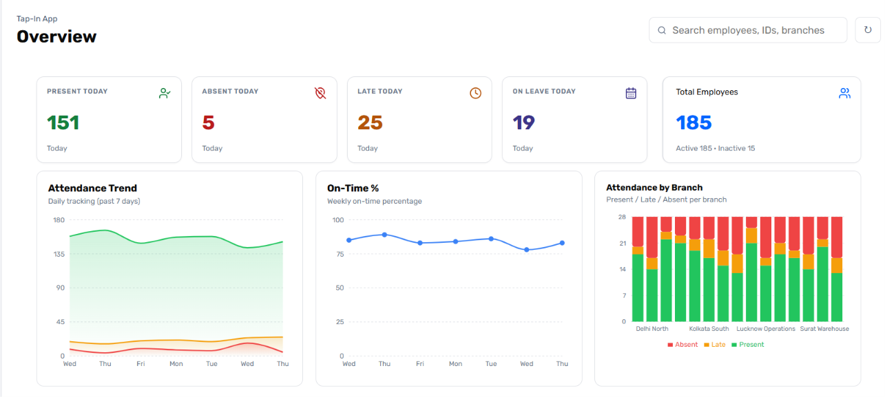
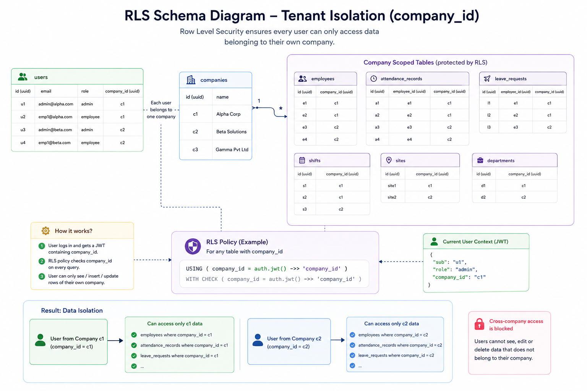

# Database, RLS & KPI Dashboard Design for a Multi-Tenant Attendance App (SaaS)

> **One Line Summary**
> Designed the multi-tenant PostgreSQL database, row-level security model, and admin KPI dashboards for An Attendance App+web - a B2B field-worker attendance SaaS serving multiple client companies on a shared backend.
### Main 11 tables and ER-Diagram


---

## 📌 Table of Contents

- [Overview](#-overview)
- [Problem Statement](#-problem-statement)
- [Dataset](#-dataset)
- [Working Structure](#-working-structure)
- [Tools & Technologies](#-tools--technologies)
- [Methods](#-methods)
- [Key Insights](#-key-insights)
- [Dashboard / Model / Output](#-dashboard--model--output)
- [How to Run This Project](#-how-to-run-this-project)
- [Results & Conclusion](#-results--conclusion)
- [Future Work](#-future-work)
- [Author & Contact](#-author--contact)

---

## 📖 Overview

This is a B2B SaaS product that lets client companies track field employee attendance, manage onboarding, and distribute salary slips - with three access tiers: super admin (web dashboard), client admin (web dashboard), and employee (mobile app). 
This project documents the part of Attendance system, I designed and own end-to-end: the **multi-tenant database schema, the row-level security (RLS) model that isolates each client's data, and the KPI dashboards** admins use to monitor attendance and workforce activity. The goal was to build a schema that scales across many client companies on one shared Postgres instance, without any tenant ever being able to see another tenant's data - and to turn raw attendance rows into KPIs that are actually useful for a non-technical client admin.

---

## ❓ Problem Statement

A single-tenant attendance app is straightforward: one company, one set of users, no isolation problem. This attendance App + Web version - needed to serve **many client companies on one shared database** while guaranteeing:
- No client admin or employee can ever query another company's data, even by accident or a malicious request
- Employees, who authenticate via a WhatsApp-shared login code provided by Company admin rather than a traditional signup, still need to be scoped correctly at the database level
- Admins need a fast, glanceable view of workforce activity (attendance rates, late check-ins, headcount) without writing SQL themselves

Getting the isolation boundary (RLS) wrong isn't a cosmetic bug - it's a data breach. Getting the KPI layer wrong means admins can't trust or use the product.

---

## 📊 Dataset

| Field | Details |
|---|---|
| **Source** | Production schema — Supabase (PostgreSQL), designed and migrated by me |
| **Structure** | Multi-tenant: `companies`, `employees`, `attendance`, `employee_documents`, `salary_slips`, `feature_flags` and related tables |
| **Tenancy Model** | Every tenant-scoped table carries a `company_id` foreign key used as the isolation boundary for RLS |
| **Employee Auth Model** | Employees authenticate via a plain-text `login_code` shared over WhatsApp — no `auth.users` row is ever created for them, which has direct consequences for how RLS has to be written (see Methods) |
| **Key Fields (attendance)** | `employee_id`, `company_id`, `check_in_time`, `check_out_time`, `status`, `location_meta` |
| **Data Quality Notes** | Cross-tenant scoping gaps and missing `WITH CHECK` clauses were identified and fixed during iterative RLS audits (see Methods) |

---

## 🏗️ Working Structure

A high-level look at the three user tiers, the core data flow, and how the database and storage layers tie everything together.


### 1. Super Admin[The Owner] (Web Dashboard)

- Manages all client companies
- Controls feature flags per company
- Oversees billing / plan tiers


### 2. Client Admin (Web Dashboard)

- Onboards employees → generates a `login_code`
- Shares the `login_code` via WhatsApp (no employee signup required)
- Views attendance records, KPIs, and reports
- Uploads salary slips and company documents


### 3. Employee (Mobile App)

- Logs in using the `login_code` (no password, no `auth.users` entry)
- Marks check-in / check-out (attendance)
- Views their own salary slips and documents
- Updates their profile via a service-role Edge Function

### Core Flow (One Line)


> Client Admin creates an employee → shares the login code via WhatsApp → Employee logs in with the code → checks in/out → data flows into the `attendance` table, scoped to their company by RLS → Admin sees it as KPIs on the dashboard.

---

## 🛠 Tools & Technologies

| Category | Tools Used |
|---|---|
| **Database** | PostgreSQL via Supabase |
| **Security Model** | Postgres Row Level Security (RLS), Postgres `GRANT`/role permissions |
| **Backend Logic** | Supabase Edge Functions (service-role, for auth paths RLS can't cover) |
| **Storage** | Cloudflare R2 & Supabase, salary slips, photos |
| **Dashboard/Frontend** | React (client/super admin web dashboards), KPI cards and chart components made by OpenCode|
| **Mobile** | Expo / React Native (employee app) made by OpenCode|
| **Version Control** | GitHub |

---

## ⚙️ Methods

### 1. Schema Design
Designed the core multi-tenant schema around a `companies` table as the tenant root, with every dependent table (`employees`, `attendance`, `employee_documents`, `salary_slips`) carrying a `company_id` foreign key. This column is the backbone of every RLS policy in the system — every isolation rule ultimately resolves back to "does this row's `company_id` match the requesting user's `company_id`."

### 2. Row Level Security (RLS) Implementation
Enabled RLS on every tenant-scoped table and wrote per-operation policies (`SELECT`, `INSERT`, `UPDATE`, `DELETE` separately, rather than a single blanket `FOR ALL`) so that read and write access could be tuned independently for admins vs. employees.

A key architectural wrinkle: employees log in via a WhatsApp-shared `login_code`, not a Supabase Auth signup — so no `auth.users` row exists for them, and `auth.uid()` is always `null` in their session. Standard RLS policies that reference `auth.uid()` silently fail for this entire user class. The fix was a dedicated **service-role Edge Function** (`update-employee-profile`) that performs authorization checks in application code and writes with elevated privileges for employee-side operations, while client admins (who do have real Supabase Auth sessions) are still governed directly by RLS.

### 3. RLS Bug Audit
Ran a structured audit across every table and found (and fixed) four recurring bug classes:
- **Missing `WITH CHECK` clauses** — a policy restricted which existing rows could be *read/touched* (`USING`) but didn't constrain what values could be written on `UPDATE`, allowing a row's `company_id` to be silently changed to someone else's tenant.
- **Missing `GRANT` statements** — RLS policies were correct, but the `authenticated` Postgres role lacked base-level `SELECT`/`INSERT` grants on the table, causing access failures that looked like RLS bugs but were actually a permissions-layer issue underneath RLS.
- **Cross-tenant scoping gaps** — some early policies checked only "is this row linked to *a* valid employee" instead of "is this row linked to *this company's* employee," which would have let one client see another client's documents.
- **Null `auth.uid()` for the WhatsApp-auth employee flow** (above) — resolved via the service-role Edge Function pattern.

### 4. KPI & Dashboard Design
Restructured the client dashboard sidebar into MAIN / COMPANY / ONBOARDING / DOCUMENTS / SETTINGS groups, and designed the KPI card layer on top of the attendance and employee tables - translating raw check-in/check-out rows into admin-facing metrics: daily attendance rate, late arrivals, active headcount, and document/salary-slip completion status per employee.

```sql
-- Example: per-tenant RLS policy pattern used across TapIn tables
CREATE POLICY "company_scoped_select"
ON attendance
FOR SELECT
USING (
  company_id = (
    SELECT company_id FROM employees WHERE id = auth.uid()
  )
);

CREATE POLICY "company_scoped_update"
ON attendance
FOR UPDATE
USING (
  company_id = (SELECT company_id FROM employees WHERE id = auth.uid())
)
WITH CHECK (
  company_id = (SELECT company_id FROM employees WHERE id = auth.uid())
);
```

### 5. Visualization
KPI cards and charts on the super admin and client admin dashboards surface attendance trends and workforce activity at a glance, replacing what would otherwise require a manual SQL query per client.

---

## 💡 Key Insights

- 📌 **RLS policies fail silently, not loudly** — a `null auth.uid()` doesn't throw an error, it just returns zero rows or blocks a write, which made an auth-model mismatch (WhatsApp login vs. Supabase Auth) look like a data bug for longer than it should have.
- 📌 **`USING` without `WITH CHECK` is an easy-to-miss cross-tenant hole** — a policy can look correct on read and still let a write smuggle in a different tenant's `company_id`.
- 📌 **Permissions and RLS are two separate layers** - a missing `GRANT` presents identically to a broken RLS policy, and debugging the wrong layer wastes real time.
- 📌 **A single `company_id` foreign key, consistently applied, is what makes multi-tenant isolation tractable** - nearly every policy in the system reduces to one comparison against this column.
- 📌 **KPI design is a translation problem, not a query problem** - the hard part wasn't computing an attendance rate, it was deciding which numbers a non-technical client admin actually needs to see first.

---

## 📸 Dashboard / Model / Output

<!-- Add screenshots of your KPI dashboard here once available -->

<!-- Caption: KPI cards showing attendance rate, active headcount, and late check-ins -->


<!-- Caption: Tenant isolation model — company_id as the root of every policy -->

---

## ▶️ How to Run This Project

### Exploring the Schema / RLS Policies

```
1. Clone this repository
2. Open /sql/schema.sql to review table definitions
3. Open /sql/rls_policies.sql to review the per-table RLS policies
4. (Optional) Spin up a local Supabase instance to test policies:
   supabase start
   supabase db reset
```

### Testing RLS Behavior

```
1. Create two test companies and one employee/admin under each
2. Authenticate as each user in turn
3. Attempt cross-tenant reads/writes and confirm they are blocked
4. Confirm same-tenant reads/writes succeed
```

---

## ✅ Results & Conclusion

The resulting schema and RLS model give TapIn database-enforced tenant isolation — client companies cannot see or modify each other's data even if application-layer code has a bug, because the guarantee lives in Postgres itself rather than in scattered `WHERE` clauses across the codebase. The KPI dashboard layer turns raw attendance data into a small set of numbers admins actually check daily, closing the loop between "the data is safe" and "the data is useful."

---

## 🔮 Future Work

- [ ] Add automated tests that assert cross-tenant access is blocked for every RLS-protected table
- [ ] Extend KPI dashboards with attendance trend forecasting (e.g. flag companies with rising late-arrival rates)
- [ ] Formalize the service-role Edge Function pattern into a reusable template for any future non-`auth.users` login flow
- [ ] Add an audit log table capturing RLS-denied access attempts for security monitoring

---

## 👤 Author & Contact

**Giridhari Khan**
:- Data Analytics 

| Platform | Link |
|---|---|
| 🐙 GitHub | [github.com/Giridhari-khan](https://github.com/Giridhari-khan) |
| 💼 LinkedIn | [Linkedin](https://linkedin.com/in/your-profile) |
| 📊 Dune | [dune.com/giridharikhan](https://dune.com/giridharikhan) |
| 📧 Email | khangiridhari8967@gmail.com |
| Tableau Public | [Tableau Public](https://public.tableau.com/app/profile/giridhari.khan/vizzes) |

---

⭐ *If you found this project useful, consider giving it a star on GitHub!*

